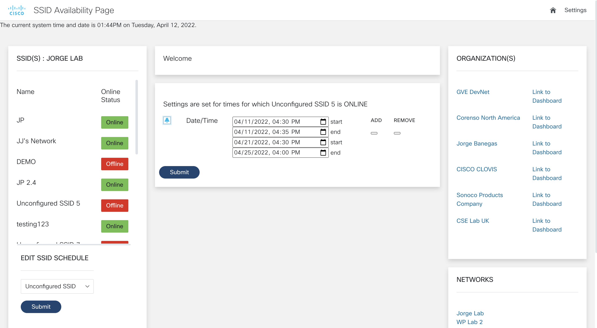

# meraki_ssid_availability_v2
Web portal in which enables the user to set several date/time schedules for Meraki SSIDs to be ON/OFF

### Author:

* Jorge Banegas (jbanegas@cisco.com)
*  April 2022
***

This version derives from this [repo](https://github.com/gve-sw/Meraki_ssid_availability_scheduler). This version enforces date/time schedules instead of weekly schedules for Meraki SSIDs. 

### Prerequisites
* Meraki API Key

# Setup instructions (Python)
1. install and clone this repo onto a server that has python3 installed 
2. install and create virtual environment (https://packaging.python.org/guides/installing-using-pip-and-virtual-environments/)
2. install and create a virtual environment for your project (https://packaging.python.org/guides/installing-using-pip-and-virtual-environments/)
3. enter the virtual environment by running source (venv name)/bin/activate 
4. install dependencies by running pip3 install -r requirements.txt file
5. install and setup mongodb (https://www.freecodecamp.org/news/learn-mongodb-a4ce205e7739/)
6. edit scheduler.py (line 6) and views.py (line 203) to include the path to your local file
7. Run the flask server by entering the command python3 views.py then visit the web page
8. Go to the settings page, then press the button only once to activate the cron job to reinforce the scheduling (crontab -l to verify cron job). Web page should ask for permission to make changes.
8. Go to the settings page, then press the button only once to activate the cron job to reinforce the scheduling (crontab -l to verify cron job). You know the scheduler activates if the web pag asks for permissions to make changes.
9. You are all set. Meraki API key will be asked to enter the page. Make sure the respective key has proper permissions to make changes to the network SSIDs

### Screenshots

### API Reference/Documentation:
* [Meraki Rest API Documentation](https://documentation.meraki.com/zGeneral_Administration/Other_Topics/The_Cisco_Meraki_Dashboard_API)

### LICENSE

Provided under Cisco Sample Code License, for details see [LICENSE](LICENSE.md)

### CODE_OF_CONDUCT

Our code of conduct is available [here](CODE_OF_CONDUCT.md)

### CONTRIBUTING

See our contributing guidelines [here](CONTRIBUTING.md)

#### DISCLAIMER:
<b>Please note:</b> This script is meant for demo purposes only. All tools/ scripts in this repo are released for use "AS IS" without any warranties of any kind, including, but not limited to their installation, use, or performance. Any use of these scripts and tools is at your own risk. There is no guarantee that they have been through thorough testing in a comparable environment and we are not responsible for any damage or data loss incurred with their use.
You are responsible for reviewing and testing any scripts you run thoroughly before use in any non-testing environment.
